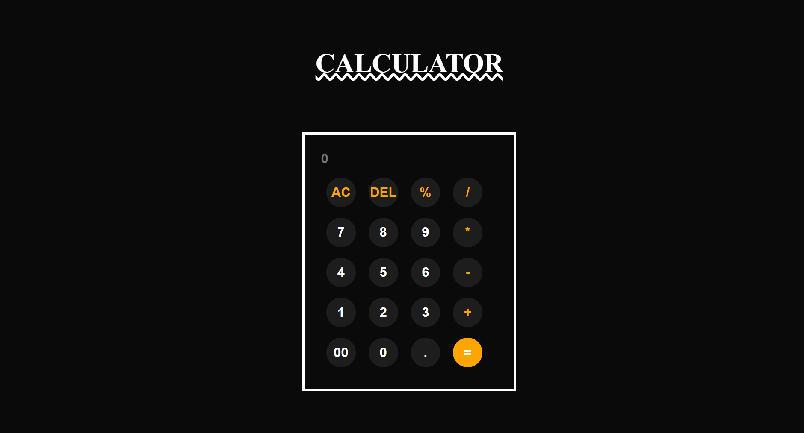

# CALCULATOR
A simple, responsive calculator built using HTML, CSS, and JavaScript that performs basic arithmetic operations.

✨ Features~
- Perform addition, subtraction, multiplication, and division.  
- Real-time result display.  
- Clear (AC) and delete (DEL) functionality. 
- Handles decimals and percentage calculations.

🛠 Tech Used~
- HTML
- CSS
- JavaScript (DOM manipulation)

🖼 Screenshot~

🚀 How to Run~
1. Clone this repository. 
2. Open index.html in your browser.  
3. Use the buttons to perform calculations.

📌 Project Status~
✅ Completed (Basic Version)
